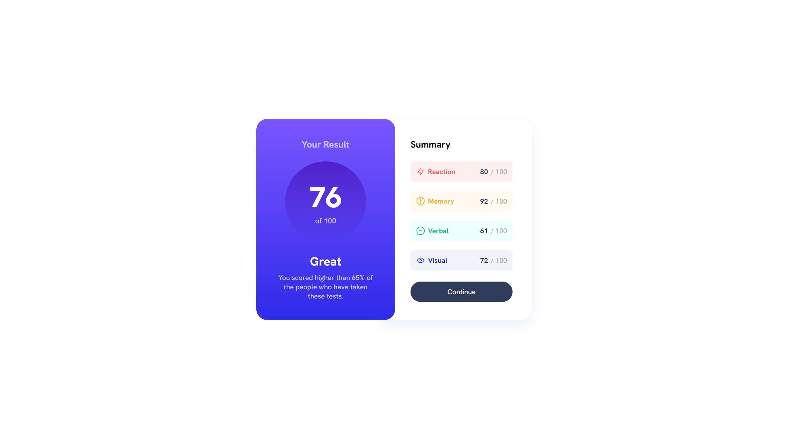

# Frontend Mentor - Results summary component solution

This is a solution to the [Results summary component challenge on Frontend Mentor](https://www.frontendmentor.io/challenges/results-summary-component-CE_K6s0maV). Frontend Mentor challenges help you improve your coding skills by building realistic projects.

## Table of contents

- [Overview](#overview)
  - [The challenge](#the-challenge)
  - [Screenshot](#screenshot)
- [My process](#my-process)
  - [Built with](#built-with)
  - [What I learned](#what-i-learned)
- [Author](#author)

**Note: Delete this note and update the table of contents based on what sections you keep.**

## Overview

### The challenge

Users should be able to:

- View the optimal layout for the interface depending on their device's screen size
- See hover and focus states for all interactive elements on the page
- **Bonus**: Use the local JSON data to dynamically populate the content

### Screenshot



### Links

- Solution URL: [Add solution URL here](https://your-solution-url.com)
- Live Site URL: [Add live site URL here](https://your-live-site-url.com)

## My process

### Built with

- Semantic HTML5 markup
- Flexbox
- CSS Grid

### What I learned

```html
<main>
  <div class="container grid grid--2-cols">
    <div class="left">
      <h1>Your Result</h1>
      <div class="result">
        <div class="score">
          <p>76</p>
          <p>of 100</p>
        </div>
      </div>
      <div class="description">
        <p>Great</p>
        <p>
          You scored higher than 65% of the people who have taken these tests.
        </p>
      </div>
    </div>
    <div class="right">
      <h2>Summary</h2>
      <div class="points">
        <div class="point reaction">
          <span class="category category-reaction"></span>
          <span class="point-result point-reaction"></span> / 100
        </div>
        <div class="point memory">
          <span class="category category-memory"></span>
          <span class="point-result point-memory"></span> / 100
        </div>
        <div class="point verbal">
          <span class="category category-verbal"></span>
          <span class="point-result point-verbal"></span> / 100
        </div>
        <div class="point visual">
          <span class="category category-visual"></span>
          <span class="point-result point-visual"></span> / 100
        </div>
      </div>
      <p class="btn-continue">Continue</p>
    </div>
  </div>
</main>
```

```css
.right {
  background-color: hsl(0, 0%, 100%);
  border-top-right-radius: 24px;
  border-bottom-right-radius: 24px;
  padding-left: 6.2rem;

  width: 32.5rem;
  box-shadow: 0 12px 24px hsl(221, 100%, 96%);
  transform: translateX(-5%);
}

.points {
  display: flex;
  flex-direction: column;
  gap: 2rem;

  color: #aaa;
}

.category,
.point-result {
  font-weight: 700;
}

.point {
  display: flex;
  align-items: center;
  gap: 0.6rem;

  padding: 1.2rem;
  border-radius: 8px;
}
.point .point-result {
  color: hsl(224, 30%, 27%);
}

.reaction {
  background-color: hsl(0, 100%, 97%);
}

.memory {
  background-color: hsl(39, 100%, 97%);
}

.verbal {
  background-color: hsl(166, 100%, 97%);
}

.visual {
  background-color: hsl(234, 85%, 97%);
}

.category {
  margin-right: auto;
}

.point .category-reaction {
  color: hsl(0, 100%, 67%);
}

.point .category-memory {
  color: hsl(39, 100%, 56%);
}

.point .category-verbal {
  color: hsl(166, 100%, 37%);
}

.point .category-visual {
  color: hsl(234, 85%, 45%);
}

.btn-continue {
  text-align: center;
  padding: 1.2rem;
  background-color: hsl(224, 30%, 27%);
  color: hsl(0, 0%, 100%);
  border-radius: 100px;
}

.btn-continue:hover {
  background: linear-gradient(hsl(252, 100%, 67%), hsl(241, 81%, 54%));
  cursor: pointer;
}
```

```js
const getJSON = async function () {
  const response = await fetch("./data.json");
  const data = await response.json();

  for (const subject of data) {
    const subjectName = subject.category.toLowerCase();

    document
      .querySelector(`.${subjectName}`)
      .insertAdjacentHTML("afterbegin", ``);

    document.querySelector(`.point-${subjectName}`).innerText = subject.score;

    document.querySelector(`.category-${subjectName}`).innerText =
      subject.category;
  }
};

getJSON();
```

## Author

- Frontend Mentor - [@UncertainlySure](https://www.frontendmentor.io/profile/UncertainlySure)
